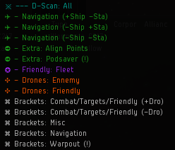
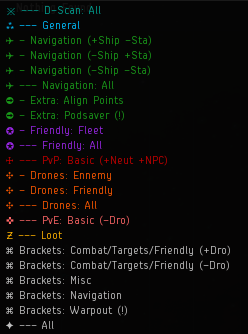
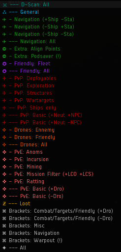
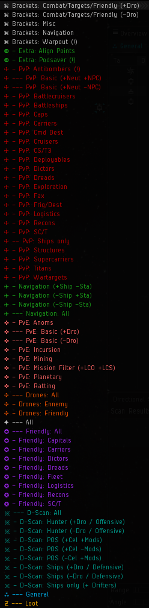
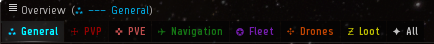
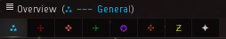
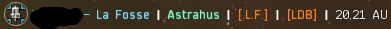
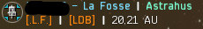

# G-A Overview Pack
### Overview Pack for EVE Online

The G-A Overview was created to provide a generalized, user-friendly overview, ready to use as is, with a solution to be adapted as required.

This project started with the desire to have a corporate display, for the different operations, and not have any problem of targeting during the activities in fleet.

___

#### features include:

- Choice of Full-Size or Compact 8-Tab Layouts that can be swapped at any time without reloading the entire pack.
- Modular Setup: Load the Preset Packs you need.
- Evolving presets for all activities on EVE, including dedicated Faction Warfare and Incursion presets among others.
- Color-coded presets by category for improved ease of selection.

___

#### Version: actuelle: v1.00.00

- Updated: **2017.07.08**
- For Release: **119.5**
- Compatible: **119.5**

#### Links

- In-game:
    - Mailing List: **G-A Overview**
    - Chat Channel: **G-A Overview**

- Changelog: **[Here](https://github.com/GhostShell77/G-A_Overview/blob/master/CHANGELOG.md)**
- FAQ: **[Here](https://github.com/GhostShell77/G-A_Overview/blob/master/FAQ.md)**
___

## How to install
#### Must Read!

- Be sure to have a quick read of **[EVE University's Overview guide](http://wiki.eveuniversity.org/Overview)**, either to learn how everything works or have a reminder.

- We expect the **player to have a minimal understanding on how the Overview System works** before attempting to install G-A and/or any other 3rd party Overview Pack.

#### Method 1: In-game, from `G-A Overview` chat channel

1. Open up your Overview Settings ( ≡ button at top left of the Overview window).  

2. Go to the "Misc" tab and click `Reset All Overview Settings`  
  
    - You **MUST** do this the first time you install.
    - This prevents any weirdness that may be caused by any changes already made to the overview.

3. Apply the `G-A Core` preset pack FIRST by clicking on its link.  
This is the only **required** preset pack.  
When combined with a Tab Layout, it includes the following presets for a minimal setup:
    - Core Presets  
      
    - **Navigation**, **Warpout** & **Brackets** presets
    - **Friendly Fleet**
    - **D-Scan: All**
    - **Drones: Ennemy & Friendly**

4. (Optional) Apply any of the following Optional preset packs by clicking on their links.  
You may need them for more specialized presets:
    - `G-A PvE Advanced Preset` contains presets for Anoms/Ratting, Incursion, Missions, and Mining.
    - `G-A PvP Advanced Preset` contains presets for Faction Warfare,Exploration, Ships Only, Deployables, Structures, and Wartargets.
    - `G-A PvP Extended Preset` packs include Target presets for specific categories, from Fighters to Frigates to Logi to Titans. Each pack contains half the categories and should be installed together.
    - `G-A Friendly Extended Preset` includes presets for Capitals, Supercapitals, Carriers, Dictors, Dreads, Logi, and Recon.
    - `G-A D-Scan Extended Preset` contains more finely-tuned presets specifically for the D-Scan filter.
    - _You can go back to add in additional packs at any time without reloading the entire pack. Simply click on a pack to add, then repeat step 5 below._
    - Note the instructions on the tab.   
    
    
    
        

5. To finish and set up the tabs, apply a Tab Layout by clicking on their links.  
Standard has each tab named for a purpose, and Compact replaces most of the names with numbers or shorter names for reduced tab width.  
2BL denotes 2 Bracket Lines, while 1BL denotes 1 Bracket Line.
 - `Standard` tab layout  
   
 - `Compact` tab layout  
   
 - `1BL` Brackets  
  
 - `2BL` Brackets  
    
    - You can alternate between Layouts at any time without reloading the entire pack by clicking on their links.
    - _Some features might not show correctly at first, it may be necessary to open the Overview Settings again, then select the Ships tab to reload the UI to force a resync and apply all changes._

#### Method 2: Out of game

1. Download:
    1. Full project:
        - Click the green "Clone or download" button located at the top right of the above file list, then click `Download ZIP`
        - It will download a complete copy of the project (not recommended).
    2. Specific release (version):
        - Click the "Releases" link near the "Clone or Download" button.
        - Go to the release you are interested in (latest release is recommneded).
        - Scroll down to `Downloads` of said release and download the `G-A-...-.zip` file.

2. Once downloaded in the folder of your preference, extract the .zip file contents in a folder of your preference.

3. Go to the most recent version folder and:
    - Copy the `G-A Full Stylized.yaml` file for the complete pre-stylized overview.
    - Or copy the `G-A Full Unstylized.yaml` file for the complete default-style overview.
    - Or copy the specific packs you want/need, alongside one or all layouts.

4. Go to `C:\Users\YourName\Documents\EVE\Overview` folder and paste the copied files there.
    - If the folder doesn't exist, you can either create it manually.
    - Or export your current overview (recommended) and it will be created automatically.
        - To export, follow step 5-6.
        - Instead of import, choose export and mark `Check All`
        - This will save your current overview and its settings.

5. Start the game and open up your Overview Settings ( ≡ button at top left of the Overview window).

6. Go to the `Misc` tab:
    - Click `Reset All` to have the default settings loaded.
    - Follow steps 5-6 and click `Import Overview Settings`

7. Select one of the copied files on the left list, click `Check All` on the top middle of the window, then click `Import`

8. Repeat step 7 if you are importing individual packs + layouts instead of a Full profile.
    - _Some features might not show correctly at first, It may be necessary to Dock and then Undock at any station to reload the UI to apply all changes._
___

#### Packs, Layouts & Presets

- G-A Core

        ⌘ Brackets: Combat / Targets / Friendly (+Dro)
        ⌘ Brackets: Combat / Targets / Friendly (-Dro)
        ⌘ Brackets: Misc
        ⌘ Brackets: Navigation
        ⌘ Brackets: Warpout (!)
        ➲ - Extra: Align Points
        ➲ - Extra: Podsaver (!)
        ✈ - Navigation (+Ship -Sta)
        ✈ - Navigation (-Ship +Sta)
        ✈ - Navigation (-Ship -Sta)
        ✥ - Drones: Ennemy
        ✥ - Drones: Friendly
        ✪ - Friendly: Fleet
        ※ --- D-Scan: All

- G-A D-Scan Extended Preset

        ※ - D-Scan: Hunter (+Dro / Offensive)
        ※ - D-Scan: Hunter (-Dro / Offensive)
        ※ - D-Scan: POS (+Cel +Mod)
        ※ - D-Scan: POS (+Cel -Mod)
        ※ - D-Scan: POS (-Cel +Mod)
        ※ - D-Scan: Ships (+Dro / Defensive)
        ※ - D-Scan: Ships (-Dro / Defensive)

- G-A Friendly Extended Preset

        ✪ - Friendly: Capitals
        ✪ - Friendly: Carriers
        ✪ - Friendly: Dictors
        ✪ - Friendly: Dreads
        ✪ - Friendly: Logistics
        ✪ - Friendly: Recons
        ✪ - Friendly: SC/T

- G-A PvE Advanced Preset

        ✜ --- PvE: Basic (+Dro)
        ✜ - PvE: Mission Filter (+LCO +LCS)
        ✜ - PvE: Anoms
        ✜ - PvE: Incursion
        ✜ - PvE: Mining
        ✜ - PvE: Ratting

- G-A PvP Advanced Preset

        ☩ --- PvP: Basic (+Neut -NPC)
        ☩ -- PvP: Ships only
        ☩ - PvP: Deployables
        ☩ - PvP: Structures
        ☩ - PvP: Wartargets
        ☩ - PvP: Exploration

- G-A PvP Extended (1/2) Preset

        ☩ - PvP: Antibombers (!)
        ☩ - PvP: Battlecruisers
        ☩ - PvP: Battleships
        ☩ - PvP: Caps
        ☩ - PvP: Carriers
        ☩ - PvP: Cmd Dest
        ☩ - PvP: Cruisers
        ☩ - PvP: CS/T3
        ☩ - PvP: Dictors
        ☩ - PvP: Dreads

- G-A PvP Extended (2/2) Preset

        ☩ - PvP: Fax
        ☩ - PvP: Fighters
        ☩ - PvP: Frig/Dest
        ☩ - PvP: Logistics
        ☩ - PvP: Recons
        ☩ - PvP: SC/T
        ☩ - PvP: Supercarriers
        ☩ - PvP: Titans

- All 4 Layouts (Standard 2BL & 1BL, Compact 2BL & 1BL)

        ☩ --- PvP: Basic (+Neut +NPC)
        ✈ --- Navigation: All
        ✜ --- PvE: Basic (-Dro)
        ✥ --- Drones: All
        ✦ --- All
        ✪ --- Friendly: All
        ⁂ --- General
        Ƶ --- Loot# G-A Overview Pack

#### Nomenclature

    - Cel:  Celestial(s)
    - Dro:  Drone(s) & Fighter(s)
    - Neut: Neutral(s)
    - NPC:  Rat(s) - Non-Player Character(s)
    - Mod:  Module(s)
    - Sta:  Station(s) & Citadel(s)
    - Offensive:    Active PvP (looking for engagements)
    - Defensive:    Passive PvP (avoiding engagements)

___

## Overview G-A

Since we can't possibly please everyone with a perfect overview solution, players have taken upon themselves to make very useful modifications to the pack.

Be sure to check them out!

## Copyright Notice

EVE Online and the EVE logo are the registered trademarks of CCP hf. All rights are reserved worldwide. All other trademarks are the property of their respective owners. EVE Online, the EVE logo, EVE and all associated logos and designs are the intellectual property of CCP hf. All artwork, screenshots, characters, vehicles, storylines, world facts or other recognizable features of the intellectual property relating to these trademarks are likewise the intellectual property of CCP hf. CCP is in no way responsible for the content on or functioning of this website, nor can it be liable for any damage arising from the use of this website.
